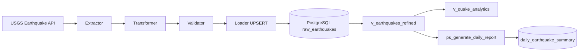

# ETL-3 | Earthquake Data Pipeline

Pipeline ETL productivo para extraer, transformar, validar y cargar eventos sismicos desde la API publica de USGS hacia PostgreSQL, con capa analitica SQL, ejecucion en Docker y automatizacion CI/CD.

## 1. Resumen Ejecutivo

Este proyecto implementa un flujo ETL end-to-end sobre datos reales de sismos globales.

- Fuente de datos: USGS Earthquake API (GeoJSON)
- Ventana de extraccion: ultimas 24 horas
- Persistencia: PostgreSQL 15
- Carga: estrategia UPSERT por clave primaria
- Analitica: vistas SQL refinadas y analiticas
- Reporteria: procedimiento almacenado para resumen diario
- Operacion: Docker Compose con perfiles dev/prod
- Calidad: validacion de esquema y reglas de datos
- DevOps: workflow CI/CD en GitHub Actions

Objetivo de portfolio: demostrar capacidades de ingenieria de datos en integracion de APIs, modelado relacional, validacion de calidad, SQL analitico, contenedorizacion y despliegue automatizado.

## 2. Arquitectura de Solucion



## 3. Stack Tecnologico

- Lenguaje: Python 3.11
- Entorno y dependencias: uv + pyproject.toml + uv.lock
- Procesamiento tabular: pandas
- Consumo API: requests
- ORM / acceso BD: SQLAlchemy + psycopg2-binary
- Base de datos: PostgreSQL 15 (alpine)
- Contenedores: Docker + Docker Compose
- Calidad y testing: ruff + pytest
- CI/CD: GitHub Actions + Docker Hub

## 4. Estructura del Proyecto

```text
.
├── .github/workflows/ci-cd.yml
├── docker-compose.yml
├── docker/Dockerfile
├── scripts/setup.sh
├── sql/
│   ├── 01_tables.sql
│   ├── 02_views.sql
│   └── 03_procedures.sql
├── src/
│   ├── main.py
│   ├── extractors/earthquake_extractor.py
│   ├── transformers/cleaner.py
│   ├── transformers/validator.py
│   └── database/
│       ├── loader.py
│       └── models.py
├── tests/test_validator.py
├── pyproject.toml
├── uv.lock
└── .env.example
```

Nota: el entrypoint funcional del pipeline es `src/main.py`.

## 5. Flujo ETL Detallado

### 5.1 Extract

Archivo: [src/extractors/earthquake_extractor.py](src/extractors/earthquake_extractor.py)

- Endpoint: `https://earthquake.usgs.gov/fdsnws/event/1/query`
- Parametros:
	- `format=geojson`
	- `starttime=<hoy-1 dia>`
	- `minmagnitude=1.0`
	- `orderby=time`
- Mecanismos de resiliencia:
	- timeout de 30s
	- hasta 3 reintentos
	- logging de estado y conteo de eventos

### 5.2 Transform

Archivo: [src/transformers/cleaner.py](src/transformers/cleaner.py)

Transformaciones aplicadas:

- Aplanado de payload GeoJSON (`features -> properties + coordinates`)
- Extraccion de coordenadas geograficas (`longitude`, `latitude`, `depth`)
- Seleccion de columnas relevantes
- Renombre de campos para modelo tabular final

Mapeo principal de campos:

| Campo origen (USGS) | Campo destino |
|---|---|
| `id` | `id` |
| `properties.place` | `place` |
| `properties.mag` | `magnitude` |
| `properties.time` | `time_epoch` |
| `properties.updated` | `updated_epoch` |
| `geometry.coordinates[0]` | `longitude` |
| `geometry.coordinates[1]` | `latitude` |
| `geometry.coordinates[2]` | `depth` |

### 5.3 Validate

Archivo: [src/transformers/validator.py](src/transformers/validator.py)

Reglas de calidad de datos:

- Validacion de esquema requerido
- Eliminacion de filas con `id` o `place` nulos
- Eliminacion de duplicados por `id`
- Rango valido de magnitud: `0 <= magnitude <= 10`
- Rango valido geoespacial:
	- `-90 <= latitude <= 90`
	- `-180 <= longitude <= 180`
- `depth` nulo se reemplaza por `0`

### 5.4 Load

Archivo: [src/database/loader.py](src/database/loader.py)

Estrategia de carga:

- Insercion en tabla `raw_earthquakes`
- UPSERT por conflicto de PK (`id`) usando `ON CONFLICT DO UPDATE`
- Campos actualizados en conflicto:
	- `magnitude`
	- `place`
	- `updated_epoch`

Beneficios:

- Idempotencia del pipeline
- Prevencion de errores por registros repetidos
- Actualizacion incremental de eventos ya existentes

## 6. Modelo de Datos y Capa SQL

### 6.1 Tabla principal de eventos

Definida en [sql/01_tables.sql](sql/01_tables.sql) y representada en [src/database/models.py](src/database/models.py).

Tabla: `raw_earthquakes`

| Columna | Tipo |
|---|---|
| `id` | `VARCHAR(50)` PK |
| `magnitude` | `FLOAT` |
| `place` | `VARCHAR(255)` |
| `time_epoch` | `BIGINT` |
| `updated_epoch` | `BIGINT` |
| `longitude` | `FLOAT` |
| `latitude` | `FLOAT` |
| `depth` | `FLOAT` |
| `extracted_at` | `TIMESTAMP` default now |

### 6.2 Vista refinada

Definida en [sql/02_views.sql](sql/02_views.sql): `v_earthquakes_refined`

Incluye:

- Conversion de epoch milisegundos a timestamp UTC (`event_time`)
- Parsing de region desde el campo `place`

### 6.3 Vista analitica

Definida en [sql/02_views.sql](sql/02_views.sql): `v_quake_analytics`

Incluye metricas avanzadas:

- Ranking de magnitud por region (`RANK OVER PARTITION BY`)
- Promedio movil de magnitud (`AVG OVER ROWS BETWEEN`)
- Tiempo entre sismos consecutivos (`LAG`)

### 6.4 Procedimiento de reporte diario

Definido en [sql/03_procedures.sql](sql/03_procedures.sql): `ps_generate_daily_report()`

Genera/actualiza la tabla `daily_earthquake_summary` con:

- fecha del reporte
- total de eventos (ultimas 24h)
- magnitud maxima
- region mas activa

## 7. Infraestructura y Despliegue

### 7.1 Docker Compose

Archivo: [docker-compose.yml](docker-compose.yml)

Servicios:

- `db`: PostgreSQL 15 Alpine
	- puerto host: `5433`
	- inicializacion automatica desde carpeta `sql/`
	- volumen persistente: `postgres_data`
- `app-dev` (perfil `dev`): build local con [docker/Dockerfile](docker/Dockerfile)
- `app-prod` (perfil `prod`): imagen publicada `donosty/etl-3:latest`

### 7.2 Imagen de aplicacion

Archivo: [docker/Dockerfile](docker/Dockerfile)

- Build en 2 etapas
- Entorno virtual generado con `uv sync --frozen`
- Usuario no root para ejecucion segura
- Comando de arranque: `uv run python src/main.py`

## 8. Ejecucion del Proyecto

### 8.1 Prerrequisitos

- Docker
- Docker Compose (plugin)
- uv

### 8.2 Variables de entorno

Basado en [.env.example](.env.example):

```env
DB_USER=admin
DB_PASSWORD=admin1234
DB_NAME=dw
```

### 8.3 Ejecucion recomendada (automatizada)

Script: [scripts/setup.sh](scripts/setup.sh)

Modo desarrollo:

```bash
./scripts/setup.sh
```

Modo produccion:

```bash
./scripts/setup.sh prod
```

Este script:

- valida dependencias del sistema
- crea `.env` desde `.env.example` si no existe
- crea directorios de logs si faltan
- levanta infraestructura con el perfil seleccionado
- espera a que el contenedor ETL termine
- exporta logs de BD y ETL a `logs/bd-logs/` y `logs/etl-logs/`

### 8.4 Ejecucion local (sin Docker para app)

```bash
uv sync --frozen
uv run python src/main.py
```

## 9. Testing y Calidad

### 9.1 Pruebas unitarias

Archivo: [tests/test_validator.py](tests/test_validator.py)

Casos cubiertos:

- elimina registros con magnitud invalida
- lanza error al faltar columnas requeridas

Ejecucion:

```bash
PYTHONPATH=. uv run pytest tests/ -v
```

### 9.2 Lint y chequeos

```bash
uv run ruff check . --select=E9,F63,F7,F82
uv run python -m py_compile src/main.py
```

## 10. CI/CD

Workflow: [.github/workflows/ci-cd.yml](.github/workflows/ci-cd.yml)

Pipeline automatizado:

1. checkout del repositorio
2. instalacion de `uv`
3. `uv sync --frozen`
4. linter (`ruff`)
5. unit tests (`pytest`)
6. syntax check
7. build y push de imagen Docker a Docker Hub (solo en `push` a `Main`)

Tags publicados:

- `donosty/etl-3:latest`
- `donosty/etl-3:<github_sha>`

## 11. Consultas SQL de Ejemplo

Ultimos eventos refinados:

```sql
SELECT *
FROM v_earthquakes_refined
ORDER BY event_time DESC
LIMIT 20;
```

Analitica por region:

```sql
SELECT id, region, magnitude, rank_magnitude_region, moving_avg_magnitude
FROM v_quake_analytics
ORDER BY event_time DESC
LIMIT 20;
```

Generar reporte diario:

```sql
CALL ps_generate_daily_report();

SELECT *
FROM daily_earthquake_summary
ORDER BY report_date DESC;
```

## 12. Logging y Observabilidad

Rutas de logs generadas por corrida:

- `logs/bd-logs/bd_run_YYYYMMDD_HHMMSS.log`
- `logs/etl-logs/etl_run_YYYYMMDD_HHMMSS.log`

El pipeline utiliza `logging` en cada etapa para trazabilidad de:

- inicio y conteo de extraccion
- transformacion completada y volumen procesado
- advertencias de validacion
- estado final de carga a BD

## 13. Fortalezas Tecnicas Demostradas

- Integracion de API externa con manejo de errores y reintentos
- Procesamiento de datos semiestructurados (GeoJSON -> tabular)
- Validacion de calidad previa a persistencia
- Carga idempotente con UPSERT transaccional
- Modelado SQL para consumo analitico
- Automatizacion de ejecucion y centralizacion de logs
- Flujo CI/CD completo para calidad y despliegue

## 14. Posibles Mejoras Futuras

- Orquestacion programada con scheduler (cron/Airflow)
- Cobertura de tests para extractor, transformer y loader
- Metricas de observabilidad (Prometheus/Grafana)
- Versionado de datos y auditoria avanzada
- Particionado de tablas para volumen historico

## 15. Autor

Proyecto desarrollado por donosty como portfolio profesional de Data Engineering.